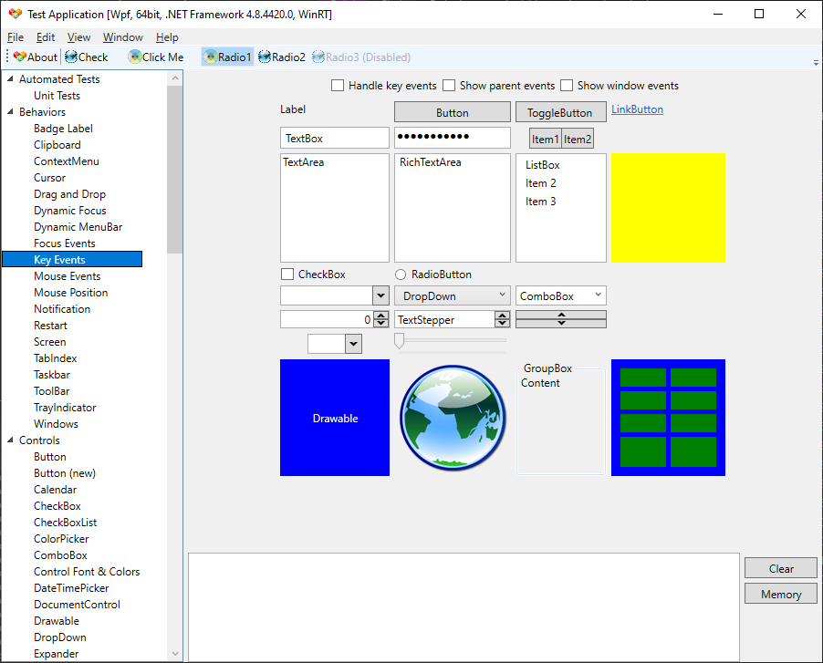
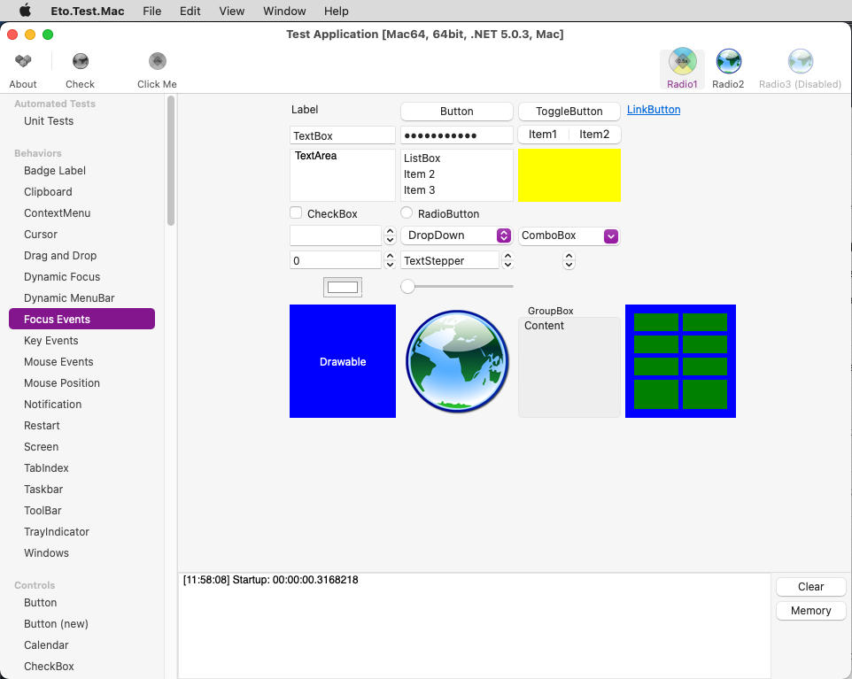
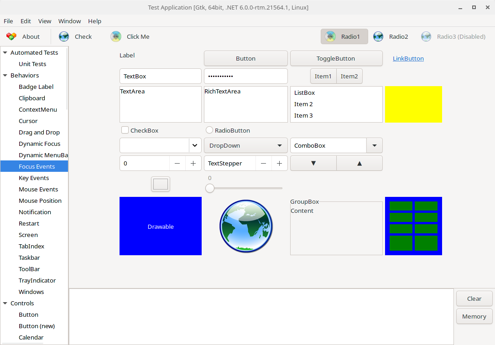

Eto.Forms
=========
### A cross platform desktop and mobile user interface framework

[](https://github.com/picoe/Eto/actions/workflows/build.yml)
[](https://github.com/picoe/Eto/discussions)
[](https://gitter.im/picoe/Eto)
[](https://github.com/picoe/Eto/wiki)
[](https://www.nuget.org/packages/Eto.Forms/)
[](https://www.myget.org/gallery/eto)

Contributing an Eto change for Rhino
------------------------------------

This is the `rhino-9.x` branch of `mcneel/Eto`, our fork of [picoe/Eto](https://github.com/picoe/Eto).
Rhino 9 builds this branch, where Eto sits inside the Rhino source tree as the submodule
`src4/DotNetSDK/Eto`.

Fixes go **upstream first**. Even when you found the bug in Rhino, make the change against
`picoe/Eto`'s `develop` branch and let it come back to us through a merge. That keeps this fork a
fast-forwardable copy of upstream, so nothing has to be re-applied every time we merge. The full
trip is:

> branch off `upstream/develop` → pull request to `picoe/Eto` → merge `develop` into `rhino-9.x` →
> bump the submodule pointer in the Rhino repo → pull request to `mcneel/rhino` `9.x`

Steps 1–4 run inside `src4/DotNetSDK/Eto` in your Rhino checkout. The examples use the
[`gh`](https://cli.github.com) CLI, but every `gh` step can be done on github.com instead.

### One-time setup

The submodule's `origin` is already `mcneel/Eto`. Add upstream alongside it:

```bash
cd src4/DotNetSDK/Eto
git remote add upstream https://github.com/picoe/Eto.git
git fetch upstream
```

### 1. Branch off upstream's develop

```bash
git fetch upstream
git checkout -b <firstname>/<short-topic> upstream/develop
```

Branch off `upstream/develop`, **not** `rhino-9.x` — otherwise your pull request drags along every
McNeel-only commit that upstream hasn't taken yet. Name the branch after yourself and the change,
matching what's already there: `curtis/mac-numericstepper-culture`,
`callum/filter-collection-add-range`.

Two things to expect while you work on this branch:

- The submodule now points at `develop`, so the surrounding Rhino tree may not build against it.
  That's normal, and step 4 puts you back on `rhino-9.x`.
- The Rhino repo shows `src4/DotNetSDK/Eto` as modified in `git status`. Leave it alone — don't
  commit that pointer change on the Rhino side yet (step 5 explains why).

### 2. Commit and push the branch here

```bash
git commit -am "Mac: Make NumericStepper format properly to invariant"
git push -u origin <firstname>/<short-topic>
```

Push to `origin` — the branch lives on `mcneel/Eto`, so anyone on the team can pick it up, and it
doesn't depend on a personal fork.

### 3. Open the pull request against picoe/Eto

```bash
gh pr create --repo picoe/Eto --base develop --head mcneel:<firstname>/<short-topic> --fill
```

The base branch is `develop`, which is upstream's mainline. (Without write access to
`mcneel/Eto`, push to your own fork of Eto instead and use
`--head <github-user>:<firstname>/<short-topic>`.)

Now wait for it to be reviewed and merged upstream — the remaining steps need the commit to exist
in `picoe/Eto`.

### 4. Merge develop into rhino-9.x

Once it's merged upstream, bring `develop` into this branch:

```bash
git checkout rhino-9.x
git pull --ff-only
git fetch upstream
git merge upstream/develop
git push origin rhino-9.x
```

If the `pull` won't fast-forward, your local `rhino-9.x` has commits that aren't on `origin` — sort
that out before merging, since this branch should be exactly what's on `mcneel/Eto`.

The merge produces the usual `Merge remote-tracking branch 'upstream/develop' into rhino-9.x`
commit. Push it straight to `origin` — we don't use pull requests on `mcneel/Eto` itself. If the
merge conflicts, it's because a McNeel-only change touched the same code; resolve it in the merge
commit, and don't rewrite upstream's history.

Your topic branch has served its purpose now and can be deleted, locally and on `mcneel/Eto`.

### 5. Bump the submodule in the Rhino repo

This part works like any other Rhino submodule: a commit that moves the pointer, on its own branch,
in a pull request. Do it only now that the Eto commit is reachable from `origin/rhino-9.x` — a
pointer to a commit that only exists on a topic branch looks fine on your machine and breaks the
build for everyone else, and for CI.

```bash
cd $(git rev-parse --show-superproject-working-tree)   # back to the Rhino root
git checkout 9.x && git pull
git checkout -b <firstname>/<short-topic>
git add src4/DotNetSDK/Eto
git commit          # subject = what the change does; body = "Fixes RH-xxxxx"
git push -u origin <firstname>/<short-topic>
gh pr create --base 9.x --fill
```

A few conventions for that commit:

- The subject describes the behaviour that changed, not the mechanics — `Mac: Make NumericStepper
  format properly to invariant`, not "update Eto submodule".
- Cite the YouTrack issue in the body: `Fixes RH-96796`, or `Cite RH-89276` when the change is
  related to an issue but doesn't close it.
- Several Eto changes can ride along in one bump. Use the subject `Eto updates` and give each
  change its own bullet in the body, with its own RH reference.
- Any Rhino-side code the change needs (say a new style in `RhinoWindows/Runtime/EtoStyles.cs`)
  belongs in the same commit, so the new Eto version and its first use land together.

Description
-----------

This framework can be used to build applications that run across multiple platforms using their native toolkit, with an easy to use API. This will make your applications look and work as a native application on all platforms, using a single UI codebase.

For advanced scenarios, you can take advantage of each platform's capabilities by wrapping your common UI in a larger application, or even create your own high-level controls with a custom implementations per platform.

This framework currently supports creating Desktop applications that work across Windows Forms, WPF, MonoMac, and GTK#.
There is a Mobile/iOS port in the works, but is considered incomplete.

This framework was built so that using it in .NET is natural. For example, a simple hello-world application might look like:

```C#
using Eto.Forms;
using Eto.Drawing;

public class MyForm : Form
{
	public MyForm ()
	{
		Title = "My Cross-Platform App";
		ClientSize = new Size(200, 200);
		Content = new Label { Text = "Hello World!" };
	}
	
	[STAThread]
	static void Main()
	{
		new Application().Run(new MyForm());
	}
}
```

or in a F# script:

```fsharp
#load ".paket/load/eto.platform.windows.fsx"
// see https://fsprojects.github.io/Paket/paket-generate-load-scripts.html

open Eto.Drawing
open Eto.Forms

type MyForm() as this =
    inherit Form()
    do
        this.Title      <- "My Cross-Platform App"
        this.ClientSize <- Size (200, 200)
        this.Content    <- new Label(Text = "Hello F# World!")

Eto.Platform.Initialize(Eto.Platforms.WinForms)
let app = new Application()
let form = new MyForm()
form.Show()
```

Getting Started
---------------

To begin creating apps using Eto.Forms, follow the [Quick Start Guide](https://github.com/picoe/Eto/wiki/Quick-Start).

To compile or contribute to Eto.Forms, read the [Contributing Guide](https://github.com/picoe/Eto/wiki/Contributing).


Screenshots
-----------
Windows via WPF:  
  
Mac via MonoMac:  
  
Linux via GTK#3:  
  

Applications
------------
* [MonoGame Pipeline Tool](https://github.com/MonoGame/MonoGame) - Content manager for MonoGame
* [Manager](http://www.manager.io) - Accounting Software
* [PabloDraw](http://picoe.ca/products/pablodraw) - Character based drawing application
* [Notedown](https://github.com/cwensley/Notedown) - Note taking application
* [Eto.Test](https://github.com/picoe/Eto/tree/master/test/Eto.Test) - Application to test the functionality of each widget
* [DWSIM](https://github.com/DanWBR/dwsim5) - Chemical Process Simulator
* [Termission](https://github.com/junian/termission) - Cross-platform Serial/TCP Terminal with Scriptable Auto-Response
* [Visual SEO Studio](https://visual-seo.com/) - Technical SEO Auditing Tool
* [RegexFileSearcher](https://github.com/CommonLoon102/RegexFileSearcher) - Cross-platform regex file searching tool in .NET 5
* [RegexTestBench](https://github.com/CommonLoon102/RegexTestBench) - Cross-platform regex testing tool in .NET 5
* [GEDKeeper (v3)](https://github.com/Serg-Norseman/GEDKeeper) - Cross-platform application for working with personal genealogical databases
* [Rhinoceros 3D](https://www.rhino3d.com) - 3D computer graphics and computer-aided design (CAD) application

Third party libraries
----------

| |Pure Eto.Forms|[SkiaSharp](https://github.com/mono/SkiaSharp) edition| | |
|---|---|---|---|---|
|[ScottPlot](https://scottplot.net/quickstart/eto/)|[](https://www.nuget.org/packages/ScottPlot.Eto/)||Plotting library that makes it easy to interactively display large datasets.|[](https://user-images.githubusercontent.com/44544090/140962349-1986e503-65d0-41bc-ae93-98f1a38a0266.png)[](https://user-images.githubusercontent.com/44544090/140963641-50117714-7dfb-4fcf-b30a-3a5f9912965a.png)
|[LiveCharts](https://lvcharts.net/)||[](https://www.nuget.org/packages/LiveChartsCore.SkiaSharpView.Eto/)|Simple, flexible, powerful and open source data visualization for .Net.|[](https://user-images.githubusercontent.com/44544090/151693514-4ad24a59-547a-4e2a-8553-678f6d558c94.gif)[](https://user-images.githubusercontent.com/44544090/151693549-7337aa21-bbf7-470d-96c7-9c8d071252bc.gif)[](https://user-images.githubusercontent.com/44544090/151693577-92917ff3-bb85-4395-ac21-c64cecfdf9ed.gif)
|[Microcharts](https://github.com/microcharts-dotnet/Microcharts)||[](https://www.nuget.org/packages/Microcharts.Eto/)|Create elegant Cross-Platform simple charts.|[](https://raw.githubusercontent.com/rafntor/Eto.Microcharts/master/quickstart.png)
|[OxyPlot](https://oxyplot.github.io/)|[](https://www.nuget.org/packages/OxyPlot.Eto/)|[](https://www.nuget.org/packages/OxyPlot.Eto.Skia/)|Cross-platform plotting library for .NET.|[](https://user-images.githubusercontent.com/44544090/156793664-e7e883fa-46ac-47cc-8d6d-bf4010837218.gif)[](https://user-images.githubusercontent.com/44544090/156793675-1b95af06-e008-456c-a14e-06bf0a135103.gif)[](https://user-images.githubusercontent.com/44544090/156795115-252c0a8a-e176-4816-bb21-5d4f6da1128a.gif)
|[Mapsui](https://mapsui.com/)||[](https://www.nuget.org/packages/Mapsui.Eto/)|A C# map component for apps.|[](https://user-images.githubusercontent.com/44544090/155893193-3b7363ce-a72b-4dd8-8267-14ca26614f9e.gif)[](https://user-images.githubusercontent.com/44544090/155893198-959f6cc4-a9b7-4c4c-8caa-a81efa0e1109.gif)[](https://user-images.githubusercontent.com/44544090/155893201-e9a9658a-3105-4860-b60d-3b06e9ec0613.gif)
|[LibVLCSharp](https://code.videolan.org/videolan/LibVLCSharp)|[](https://www.nuget.org/packages/LibVLCSharp.Eto/)||Display a video in an Eto app.|[](https://user-images.githubusercontent.com/44544090/159070887-200bf7c7-221e-45d3-afa5-284967ee65de.png)[](https://user-images.githubusercontent.com/44544090/159070888-176e8b93-dee1-4247-a143-3c15c8eab6b7.png)
|[Eto.OpenTK](https://github.com/picoe/Eto.OpenTK)|[](https://www.nuget.org/packages/Eto.OpenTK/)||OpenGL viewport control for Eto.Forms using OpenTK.|
|[Eto.Veldrid](https://github.com/picoe/Eto.Veldrid)|[](https://www.nuget.org/packages/Eto.Veldrid/)||A control to embed the Veldrid graphics library in Eto.Forms.|
|[Eto.CodeEditor](https://www.nuget.org/packages/Eto.CodeEditor)|[](https://www.nuget.org/packages/Eto.CodeEditor/)||A package that gives you a code editor control in Eto.Forms.|
|[Eto.HtmlRenderer](https://www.nuget.org/packages/Eto.HtmlRenderer)|[](https://www.nuget.org/packages/Eto.HtmlRenderer/)||Provides an Eto control to display HTML content.|
|[Eto.RainbowLoading](https://github.com/rafntor/Eto.RainbowLoading)|[](https://www.nuget.org/packages/Eto.RainbowLoading/)|[](https://www.nuget.org/packages/Eto.RainbowLoading.Skia/)|A control showing the Android loading indicator.|[](https://raw.githubusercontent.com/rafntor/Eto.RainbowLoading/master/Animation.gif)
|[Eto.GifImageView](https://github.com/rafntor/Eto.GifImageView)|[](https://www.nuget.org/packages/Eto.GifImageView/)||A control for displaying GIF's.|[](https://raw.githubusercontent.com/rafntor/Eto.GifImageView/master/Animation.gif)
|[Eto.SkiaDraw](https://github.com/rafntor/Eto.SkiaDraw)|[](https://www.nuget.org/packages/Eto.SkiaDraw/)||A control enabling use of SkiaSharp in Eto.
|[Eto.Containers](https://github.com/rafntor/Eto.Containers)|[](https://www.nuget.org/packages/Eto.Containers/)||Some extra Eto.Forms container controls.

&#128073; Note : Some packages are in the pipeline but will not appear until next release is created.

Assemblies
----------

Your project only needs to reference Eto.dll, and include the corresponding platform assembly that you wish to target. To run on a Mac platform, you need to [bundle your app](https://github.com/picoe/Eto/wiki/Running-your-application).

* Eto.dll - Eto.Forms (UI), Eto.Drawing (Graphics), and platform loading
* Eto.Mac64.dll - Lightweight Mac platform using .NET 6+ or mono
* Eto.macOS.dll - .NET 6+ platform for Mac (for use with the net6.0-macos target)
* Eto.WinForms.dll - Windows Forms platform using GDI+ for graphics
* Eto.Direct2D.dll - Windows Forms platform using Direct2D for graphics
* Eto.Wpf.dll - Windows Presentation Foundation platform
* Eto.Gtk.dll - Gtk+3 platform for Mac, Windows, and Linux.
* Eto.iOS.dll - Xamarin.iOS platform
* Eto.Android.dll - Xamarin.Android platform

Currently supported targets
---------------------------

* OS X: MonoMac or net6.0-macos
* Linux: GTK+ 3
* Windows: Windows Forms (using GDI or Direct2D) or WPF
	
Under development
-----------------

These platforms are currently incomplete or in development. Any eager bodies willing to help feel free to do so!

* iOS using Xamarin.iOS
* Android using Xamarin.Android (Eto.Android)
